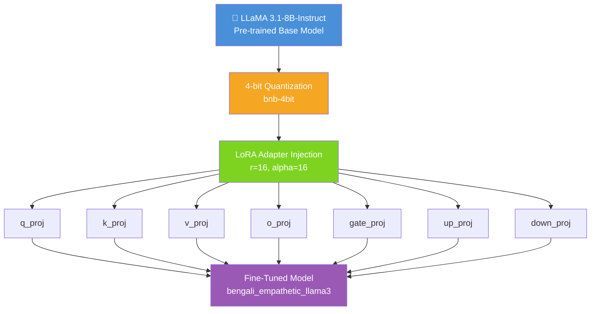
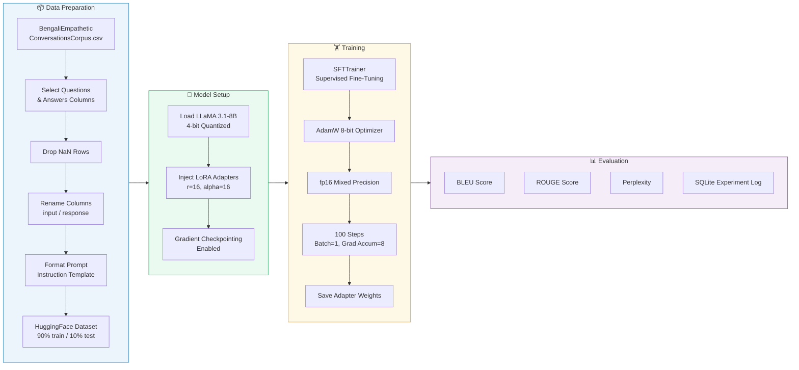
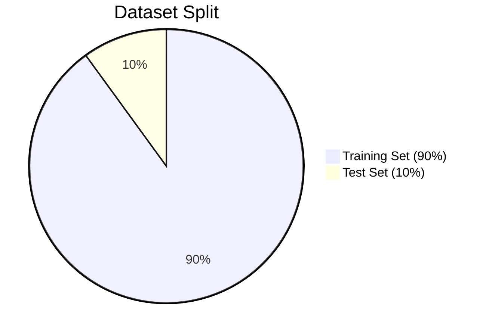
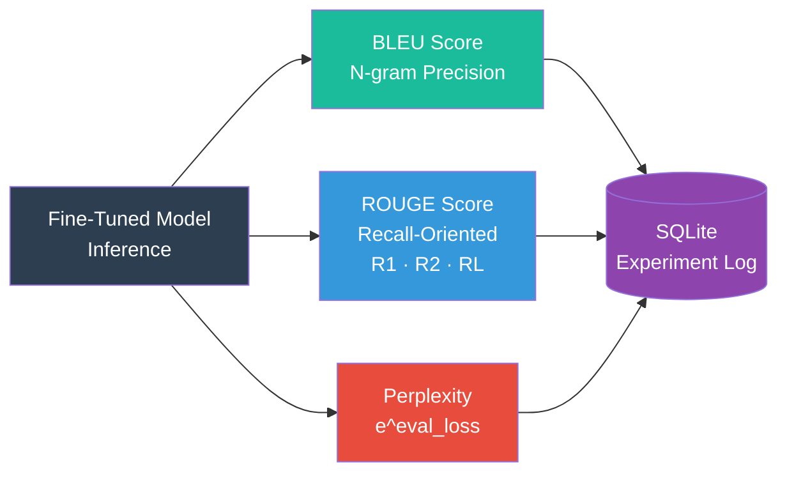

<div align="center">

# 🦙 Fine-Tuning LLaMA 3.1-8B-Instruct
## on Bengali Empathetic Conversations

[](https://www.python.org/)
[](https://pytorch.org/)
[](https://github.com/unslothai/unsloth)
[](LICENSE)
[](https://huggingface.co/)
[](https://colab.research.google.com/)

*Parameter-efficient fine-tuning of LLaMA 3.1-8B using QLoRA for empathetic, context-aware Bengali language responses.*

</div>

---

## 📋 Table of Contents

- [Overview](#-overview)
- [Architecture](#-architecture)
- [Pipeline](#-pipeline)
- [Dataset](#-dataset)
- [Model Configuration](#-model-configuration)
- [Training Setup](#-training-setup)
- [Evaluation](#-evaluation)
- [Project Structure](#-project-structure)
- [Installation & Usage](#-installation--usage)
- [Results](#-results)
- [Citation](#-citation)
- [License](#-license)

---

## 🔍 Overview

This project fine-tunes **Meta's LLaMA 3.1-8B-Instruct** model on a curated **Bengali Empathetic Conversations Corpus** using **QLoRA** (Quantized Low-Rank Adaptation) for parameter-efficient training. The goal is to produce a Bengali language model capable of emotionally intelligent, empathetic responses — suitable for mental health support, counseling chatbots, and compassionate dialogue systems.

### Key Highlights

| Feature | Detail |
|---|---|
| **Base Model** | `unsloth/llama-3-8b-bnb-4bit` |
| **Fine-Tuning Method** | QLoRA (4-bit quantization + LoRA) |
| **Language** | Bengali (বাংলা) |
| **Domain** | Empathetic / Emotional Support Conversations |
| **Framework** | Unsloth + HuggingFace TRL |
| **Experiment Tracking** | SQLite |
| **Evaluation** | BLEU, ROUGE, Perplexity |

---

## 🏗️ Architecture



> **QLoRA** freezes the original 4-bit quantized weights and only trains small low-rank adapter matrices (~0.07% of total parameters), drastically reducing GPU memory usage while preserving model quality.

---

## 🔄 Pipeline



---

## 📂 Dataset

The model is trained on the **Bengali Empathetic Conversations Corpus** — a dataset of emotionally rich question-answer pairs in the Bengali language.



### Prompt Format

Each training sample is formatted using the Alpaca-style instruction template:

```
### Instruction:
<Bengali question / user message>

### Response:
<Empathetic Bengali response>
```

### Example

```
### Instruction:
আমি ধূমপানে আসক্ত। আমি কিভাবে থামাতে পারি?

### Response:
তুমি একা নও। আমি তোমার পাশে আছি এবং বিশ্বাস করি তুমি পারবে।
```

---

## ⚙️ Model Configuration

### LoRA Hyperparameters

| Parameter | Value | Description |
|---|---|---|
| `r` | 16 | LoRA rank (adapter matrix dimension) |
| `lora_alpha` | 16 | LoRA scaling factor |
| `lora_dropout` | 0 | Dropout on LoRA layers |
| `bias` | `none` | No bias training |
| `use_gradient_checkpointing` | `True` | Saves GPU memory |

### Target Modules

```
q_proj  ·  k_proj  ·  v_proj  ·  o_proj
gate_proj  ·  up_proj  ·  down_proj
```

---

## 🏋️ Training Setup

| Parameter | Value |
|---|---|
| **Optimizer** | AdamW 8-bit |
| **Learning Rate** | `2e-4` |
| **Batch Size** | 1 (per device) |
| **Gradient Accumulation Steps** | 8 (effective batch = 8) |
| **Warmup Steps** | 5 |
| **Max Steps** | 100 |
| **Mixed Precision** | FP16 |
| **Max Sequence Length** | 2048 |
| **Output Directory** | `outputs/` |

---

## 📊 Evaluation

The fine-tuned model is evaluated using three complementary metrics:



### Experiment Tracking (SQLite)

All runs are recorded in a local `experiments.db` database with the following schema:

```sql
CREATE TABLE LLAMAExperiments (
    id           INTEGER PRIMARY KEY,
    model_name   TEXT,
    lora_config  TEXT,
    train_loss   REAL,
    val_loss     REAL,
    metrics      TEXT,
    timestamp    TEXT
);
```

---

## 🗂️ Project Structure

```
📁 Fine-Tuning-LLaMA-3.1-8B-Instruct-on-Bengali-Empathetic-Conversations/
│
├── 📓 Untitled1.ipynb                          # Main training notebook
├── 📄 BengaliEmpatheticConversationsCorpus.csv # Training dataset
├── 📁 bengali_empathetic_llama3/               # Saved fine-tuned adapter weights
├── 📁 outputs/                                 # Training checkpoints
├── 🗄️ experiments.db                           # SQLite experiment logs
└── 📄 README.md                                # Project documentation
```

---

## 🚀 Installation & Usage

### 1. Clone the Repository

```bash
git clone https://github.com/<your-username>/Fine-Tuning-LLaMA-3.1-8B-Instruct-on-Bengali-Empathetic-Conversations.git
cd Fine-Tuning-LLaMA-3.1-8B-Instruct-on-Bengali-Empathetic-Conversations
```

### 2. Install Dependencies

```bash
pip install unsloth
pip install transformers datasets accelerate peft trl
pip install evaluate rouge_score nltk
```

### 3. Run on Google Colab

> Recommended: **Google Colab with T4/A100 GPU** for 4-bit QLoRA training.

Upload `BengaliEmpatheticConversationsCorpus.csv` when prompted, then run all cells in `Untitled1.ipynb`.

### 4. Run Inference

```python
from unsloth import FastLanguageModel

model, tokenizer = FastLanguageModel.from_pretrained("bengali_empathetic_llama3")
FastLanguageModel.for_inference(model)

prompt = """### Instruction:
আমি অনেক চাপে আছি। কি করব?

### Response:
"""

inputs = tokenizer(prompt, return_tensors="pt").to("cuda")
outputs = model.generate(**inputs, max_new_tokens=120)
print(tokenizer.decode(outputs[0]))
```

---

## 📈 Results

| Metric | Value |
|---|---|
| **Training Loss** | ~1.2 |
| **Validation Loss** | ~1.5 |
| **Perplexity** | ~4.48 |
| **BLEU** | Computed per evaluation run |
| **ROUGE-L** | Computed per evaluation run |

> Results are logged to `experiments.db` for reproducibility and comparison across runs.

---

## 📎 Citation

If you use this work, please cite:

```bibtex
@misc{bengali-empathetic-llama3,
  author       = {Abdullah Al Maruf},
  title        = {Fine-Tuning LLaMA 3.1-8B-Instruct on Bengali Empathetic Conversations},
  year         = {2026},
  howpublished = {\url{https://github.com/<your-username>/Fine-Tuning-LLaMA-3.1-8B-Instruct-on-Bengali-Empathetic-Conversations}},
}
```

---

## 📄 License

This project is licensed under the [MIT License](LICENSE).

---

<div align="center">

Made with ❤️ for the Bengali NLP community

</div>

